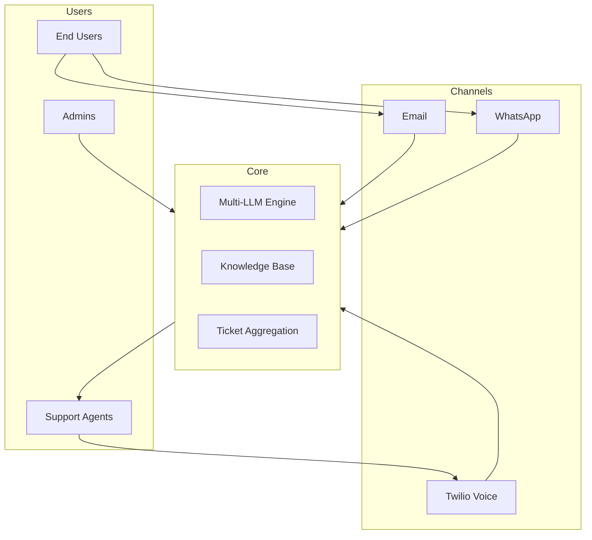
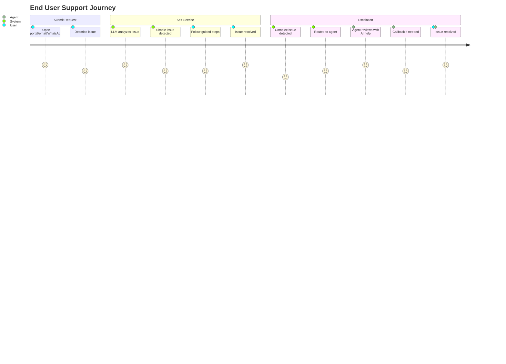

# hurAI - Discovery Summary Report

**Date:** 2025-12-17  
**Status:** Requirements Gathered

---

## Executive Summary

**hurAI** is an AI-augmented helpdesk system designed to streamline support operations through intelligent automation, multi-channel integration, and knowledge reuse. The system targets small support teams (1-5 agents) handling ~50 tickets/day initially, with a mobile-first end-user experience.

---

## Project Scope

### Vision
Transform helpdesk operations from skill-dependent, siloed support to AI-assisted, knowledge-sharing, self-service-enabled platform.

### Core Value Propositions
1. **Reduce Redundancy** — Cross-session learning prevents reinventing solutions
2. **Lower Skill Barrier** — AI assists both users and agents
3. **Multi-Channel Aggregation** — Unified view of Email + WhatsApp + Voice

---

## Key Requirements Summary



### MVP Features
| Feature | Description |
|---------|-------------|
| Multi-channel ingestion | Email + WhatsApp |
| Self-service resolution | LLM-guided for simple issues |
| Agent AI assistance | Suggestions + similar tickets |
| Voice callbacks | Twilio with live LLM listening |
| Knowledge Base | Smart search + auto-population |
| Multi-LLM support | Configurable model selection |

### Phase 2 Features
- Screen sharing / remote sessions
- Additional channels (Slack, Teams)
- Advanced analytics

---

## Technical Decisions

| Aspect | Decision |
|--------|----------|
| **Platform** | Web application (single codebase) |
| **End User UX** | Mobile-first responsive |
| **Agent/Admin UX** | Desktop-optimized |
| **Scale (MVP)** | 1-5 agents, 50 tickets/day |
| **LLM Strategy** | Multi-model, configurable per task |

---

## Security Architecture

> [!CAUTION]
> **Critical Requirement:** LLMs must NOT have access to personal user information.

### PII Protection Strategy
```
[User Data] → [PII Anonymizer] → [LLM Processing] → [Response] → [Context Restoration]
```

### Required Security Controls
- HTTPS & encryption at rest
- Role-based access control (RBAC)
- Audit logging
- API token security
- GDPR compliance

---

## Potential Gaps & Clarifications Needed

> [!WARNING]
> The following items need further clarification before development.

### 1. PII Anonymization Scope
- **Question:** What specific fields need anonymization? (name, email, phone, addresses, custom fields?)
- **Question:** Should anonymization be reversible for agents?

### 2. LLM Configuration
- **Question:** Who can configure LLM models — Admin only or Team Leads too?
- **Question:** Should there be fallback logic if primary LLM fails?

### 3. WhatsApp Business API
- **Question:** Do you have an existing WhatsApp Business account?
- **Question:** Expected message volume for pricing tier selection?

### 4. Twilio Voice Features
- **Question:** Is call recording required for training/QA?
- **Question:** Real-time transcription accuracy requirements?

### 5. Knowledge Base
- **Question:** Will KB be manually populated or auto-generated from resolved tickets?
- **Question:** Who can edit KB articles — Agents, Team Leads, or Admins only?

### 6. Self-Service Scope
- **Question:** How do we define "simple" vs "complex" issues?
- **Question:** Should there be a confidence threshold for LLM to attempt self-service?

### 7. Escalation Rules
- **Question:** What triggers escalation from Agent to Team Lead?
- **Question:** SLA requirements for response/resolution times?

---

## Next Steps

1. **Clarify Gaps** — Review and answer the questions above
2. **Prioritize MVP** — Finalize feature list for first release
3. **Technical Architecture** — Design system components
4. **UI/UX Design** — Create wireframes and prototypes
5. **Development Planning** — Break down into sprints

---

## Appendix: User Journey Map


